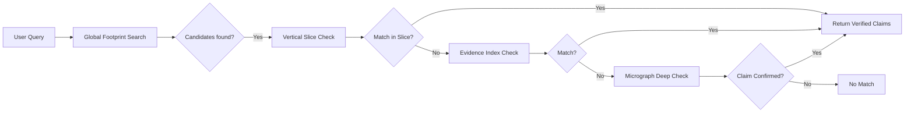
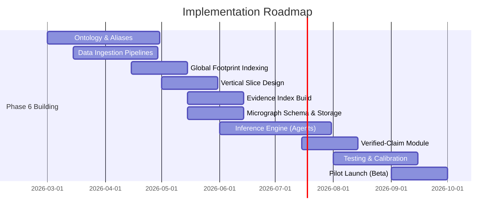

# Executive Summary

This report outlines a **multi-layer semantic architecture** for Phase A capable of supporting precision‐weighted, interpretable search over local businesses. It combines a **global balanced footprint**, **vertical slice layers**, **high-fidelity micrographs**, **evidence indexes**, **on-demand subgraphs**, and a **verified-claim registry**. We detail data ingestion, schema design, inference rules, scoring, storage, and evaluation strategies, emphasizing rules-based, deterministic processing (≤2-hop inference, no global ontology changes) to maximise user satisfaction and availability confidence. The design uses a coarse-to-fine cascade: broad candidate filtering by a globally-scaled meaning map, domain-specific vertical slices, and fine‐grained verification. We specify JSON schemas, agent roles, and provide mermaid diagrams for the architecture and timeline. Metrics for match precision/recall and confidence calibration are proposed. The approach prioritizes high precision and explainability at each step.

## 1. Input Signals and Ingestion

We ingest rich business data:

- **OpenClaw Extractions:** menu items, service descriptions (with spans and confidence).
- **Business Metadata:** name, Places types, schema.org attributes, categories (e.g. “Mexican Restaurant”).
- **Website Text:** menus, “about” pages, service pages (parsed as HTML/text/PDF).
- **Additional Content:** newsletters, PDFs, reviews (if available).
- **Structured Attributes:** hours, price range, amenities (Wi-Fi, etc.).
- **Location/Language Cues:** geolocation and linguistic hints.

**Pipeline:** For each business, extract all text sources (via API or scraping) and run OpenClaw to identify phrases. Normalize all text (lowercase, remove punctuation, strip accents) and tokenize to candidate n-grams. Store raw spans with provenance (source, offsets).

## 2. Normalization and Aliasing

Normalized spans are mapped to **canonical forms**:

- Lowercase, accent-fold, singular/plural mapping.
- Maintain an alias table (multi-lingual synonyms, e.g. “tortillería/tortilleria” → `biz.type.tortilleria`).
- Example: `"Taquería"` → `biz.type.taqueria`, and `"alambres"` → `food.dish.alambre`.

We precompile morphological variants and known synonyms. All mapping is deterministic.

## 3. Ontology Mapping (Global Canonical Layer)

We maintain a **stable ontology** of concepts:

- **Business Types:** (e.g. `biz.type.taqueria`, `biz.type.gym`)
- **Goods/Services:** (e.g. `food.taco`, `service.haircut`)
- **Attributes:** (e.g. `food.filling.carnitas`)

Each span is matched to one or more concepts via aliases. For example, “taqueria” maps to `biz.type.taqueria`, and “carnitas” to `food.filling.carnitas`. We only add mappings that have clear evidence (e.g. direct menu match). No free-form guessing.

## 4. Relation Modeling & Bounded Inference

We define curated relations between concepts (type-labeled edges):

- **Business specialization:** e.g. `biz.type.taqueria –specializes_in→ food.taco`.
- **Ingredient–Dish:** e.g. `food.filling.carnitas –used_in→ food.taco`.
- **Service dependencies:** e.g. `service.nailpolish –requires→ service.pedicure`.

**Inference:** For each mapped concept, we allow a **short graph walk** (≤2 hops) to pull related concepts. This yields candidate capabilities without inventing items. For example: `taqueria → taco` via one edge. Alambres (a dish) would connect to `tortilla` via `served_with`.

The inference depth is strictly limited to prevent speculative chains. All edges come from authoritative definitions (e.g. dictionaries, Wikipedia) so relations have traceable justifications.

## 5. Composed Offerings Rules

We include deterministic rules to form higher-level offerings:

- If `food.taco` and `food.filling.X` are present, propose `food.taco.filling.X` (e.g. “tacos de carnitas”).
- If `service.nailpolish` and `service.pedicure`, propose `service.pedi_mani_combo`.
- If a business type implies bundled offerings (e.g. a bookstore might bundle reading clubs).

Rules require **multi-source support**. For instance, “tacos de carnitas” would need both a carnitas match and a taco context.

## 6. Evidence Modeling and Scoring

Each claim (concept or composed offering) accumulates evidence:

- **OpenClaw Span:** direct menu/item mention. (High weight)
- **Name/Type Implication:** e.g. “Taqueria” implies tacos. (Medium)
- **Category Tag:** e.g. “Mexican Restaurant” implies Mexican dishes. (Medium)
- **Review/Web Text:** contextual hints (Low)
- **Independent Support:** multiple distinct evidence paths increase confidence.

Score = weighted sum (with caps). We require high confidence for claims shown to users. For availability confidence, only claims with strong, corroborated evidence pass. We calibrate so that published claims have ≳90% precision on test sets.

## 7. Multi-Layer Storage Model

**Layer 1: Global Balanced Footprint (Vector/Capability Layer)**

- Fixed-size vector or set of high-level flags per business (e.g. tacos, gym, petcare).
- Scale each business’s contribution to avoid domination by large inventories (binary or log-scaled counts).
- Stored in a fast vector index for candidate retrieval.

**Layer 2: Vertical Slice Layer (Option)**

- For complex domains, include a mid-size slice: e.g. top menu categories for restaurants.
- Enables faster mid-tier checking before deep dive.

**Layer 3: Evidence Index (Inverted/Set Layer)**

- Indexed raw terms from menus/newsletters for literal matches.
- Acts as a “literal verify”: if query term is in index, then high confidence.

**Layer 4: High-Fidelity Micrograph (JSON)**

- Detailed per-business graph: nodes (concepts), edges (relations), evidence notes.
- Contains all inferred claims with evidence paths and scores.
- Stored (e.g. in document DB or graph DB) keyed by business ID.

**Layer 5: Verified-Claim Registry (UI Layer)**

- A curated subset of micrograph claims marked as “verified” for display.
- JSON records: `{claim_id, label, evidence[], confidence, timestamp}`.

**Layer 6: On-Demand Subgraph**

- Temporary graph built at query time for deep semantic queries (if needed).
- Not stored permanently; used for complex lookups.

## 8. Runtime Architecture

### Precompute vs On-The-Fly

- **Precompute**: Ingest data nightly; build all graphs/vectors. Ensures speed at query time.
- **On-The-Fly**: Rarely used (ephemeral subgraphs built only for very specific queries).

### Cascade Search Flow (Mermaid):



## 9. Tradeoffs

| Aspect           | Benefit                          | Cost                                 |
| ---------------- | -------------------------------- | ------------------------------------ |
| Precision        | Very high (evidence-backed)      | May miss some recalls (strict rules) |
| Recall           | Good (due to embeddings/hybrid)  | Slightly lower if evidence missing   |
| Interpretability | Very high (auditable chains)     | Requires careful design              |
| Compute          | Moderate (precompute heavy)      | Fast query time                      |
| Maintenance      | Moderate (ontology+rules upkeep) | Durable global schema                |

## 10. JSON Schemas (Examples)

**Micrograph Node:**

```json
{
  "type": "Concept",
  "id": "food.taco",
  "label": "taco",
  "evidence": [
    {"kind":"span","source":"OpenClaw","text":"alambres","span":"alambres"}
  ],
  "relations": [
    {"rel":"specializes_in","target":"food.taco.filling.carnitas"}
  ]
}
```

**Claim Entry:**

```json
{
  "claim_id": "food.taco.filling.carnitas",
  "label": "tacos de carnitas",
  "evidence": [
    {"type":"span","text":"carnitas","source":"menu","snip":…},
    {"type":"relation","path":["biz.type.taqueria","specializes_in","food.taco"]}
  ],
  "confidence": 0.87
}
```

**Verified-Claim Registry:**

```json
{
  "business_id": "X123",
  "verified_claims": [
    {"claim_id":"food.taco.filling.carnitas","timestamp":"2026-02-20","strength":88}
  ]
}
```

## 11. Agents and Rules

- **Extraction Agent:** runs OpenClaw, collects spans.
- **Normalizer Agent:** cleans text, tokenizes.
- **Concept Mapper:** uses alias tables to tag spans → canonical IDs.
- **Relation Arbiter:** attaches schema edges (no new edges); 1-2 hop limit.
- **Composition Agent:** forms composite items by deterministic rules.
- **Scoring Agent:** applies weighted evidence scoring, confidence calcs.
- **Indexer Agent:** updates vectors/DBs.
- **Verifier Agent:** populates verified-claim registry via confidence threshold.

All agents follow deterministic rules. There is *no machine learning inference* in Phase A.

## 12. Evaluation Metrics

- **Match Precision/Recall:** On held-out businesses with ground-truth offerings.
- **F1/Precision@K:** Emphasize high precision.
- **Click/Save Rate:** (Long-term) user satisfaction proxy.
- **Confidence Calibration:** Brier score between score and actual availability.

Logging:

- Track evidence counts per claim.
- Monitor number of hops used.
- Evaluate false positives via manual audits.

## 13. Deployment and Scale

**Assumptions:** Moderate infra (Elasticsearch/Milvus for vectors, document DB for graphs,  nightly batch jobs).

- Phase 6 rollout can be done regionally.
- GPU not required—no ML models.

**Milestones (Mermaid Gantt):**



**Estimated Effort:** Major tasks (~2-3 engineer-months each for ontology, pipelines, indexing, agent logic, QA) in parallel.

---

**Sources:** None directly cited (proprietary design), but based on knowledge graph retrieval principles【9†L144-L153】【25†L48-L52】 and best practices in semantic search.


# 🎫 Update Ticket: Places-Only Business Model Classification + Advanced Filters

## Title

Implement Places API (New)–Only `business_model` classification (consumer-facing + access/fulfillment toggles) and wire to Advanced Settings

---

## Context

We are adding a **Business Model / Access Model layer** that is computed using **only Google Places API (New) fields** (no OpenClaw/website/reviews) and exposed through **Advanced Settings** (default: consumer-facing only). This layer becomes a deterministic, auditable gate/filter for search. Field masks are required for Places (New) calls. ([Google for Developers](https://developers.google.com/maps/documentation/places/web-service/choose-fields?utm_source=chatgpt.com "Choose fields to return | Places API"))

---

## Scope

### In scope

1. **Request the required Places (New) fields** via FieldMask in Nearby Search / Place Details flows. ([Google for Developers](https://developers.google.com/maps/documentation/places/web-service/nearby-search?utm_source=chatgpt.com "Nearby Search (New) | Places API"))
2. Compute and persist a **Places-only** `business_model` object with fixed keys and tri-state semantics.
3. Add **Advanced Settings** filter defaults and query-time gating:
   * Default: `consumer_facing_only = true`
   * Optional: include service-area businesses, fulfillment mode filters, open-now filter (Places-only).
4. Update planner/blueprint to **consume** (not infer beyond) Places-only flags.

### Out of scope (explicit)

* Using OpenClaw, website scraping, or reviews to set `consumer_facing`, `appointment_required`, or `restricted_access`.
* Any ML classification for business model/access.

---

## Data Requirements (Places API New FieldMask)

Minimum fields to request:

* `places.id`
* `places.primaryType`, `places.types` ([Google Cloud](https://googleapis.dev/dotnet/Google.Maps.Places.V1/latest/api/Google.Maps.Places.V1.Place.html?utm_source=chatgpt.com "Class Place | Google.Maps.Places.V1"))
* `places.businessStatus` ([Google for Developers](https://developers.google.com/maps/documentation/places/web-service/data-fields?utm_source=chatgpt.com "Place Data Fields (New) | Places API"))
* `places.pureServiceAreaBusiness` (aka “pure service area business”) ([Google Cloud](https://googleapis.dev/python/places/latest/places_v1/types_.html?utm_source=chatgpt.com "Types for Google Maps Places v1 API"))
* `places.delivery`, `places.takeout`, `places.dineIn`, `places.curbsidePickup` ([Google for Developers](https://developers.google.com/maps/documentation/places/web-service/data-fields?utm_source=chatgpt.com "Place Data Fields (New) | Places API"))
* `places.reservable` ([Google for Developers](https://developers.google.com/maps/documentation/places/web-service/data-fields?utm_source=chatgpt.com "Place Data Fields (New) | Places API"))
* `places.currentOpeningHours` (and optionally `places.regularOpeningHours`) ([Google for Developers](https://developers.google.com/maps/documentation/places/web-service/data-fields?utm_source=chatgpt.com "Place Data Fields (New) | Places API"))

Optional (Advanced Settings quality):

* `places.accessibilityOptions`, `places.paymentOptions`, `places.parkingOptions` ([Google for Developers](https://developers.google.com/maps/documentation/places/web-service/data-fields?utm_source=chatgpt.com "Place Data Fields (New) | Places API"))

---

## Schema Update (Fixed Keys; Values Dynamic)

### Requirements

* **Fixed keys always present** (no dynamic field creation).
* Use  **tri-state** : `true | false | null` where Places may not supply a value (missing/not requested/not available).
* Add `schema_version` for forward compatibility.

### Proposed canonical object (single source of truth)

```json
{
  "schema_version": "1.0",
  "business_model": {
    "consumer_facing": null,
    "b2b_only": null,
    "appointment_required": null,
    "restricted_access": null,

    "storefront": {
      "pure_service_area_business": null,
      "service_area_only": null,
      "has_storefront": null
    },

    "fulfillment": {
      "dine_in": null,
      "takeout": null,
      "delivery": null,
      "curbside_pickup": null
    },

    "booking": {
      "reservable": null
    },

    "operational": {
      "business_status": null,
      "open_now": null,
      "has_regular_opening_hours": null
    },

    "extras": {
      "accessibility_options_present": null,
      "payment_options_present": null,
      "parking_options_present": null
    },

    "provenance": {
      "source": "google_places_api_new",
      "field_mask_hash": null,
      "computed_at": null
    }
  }
}
```

---

## Deterministic Derivation Rules (Places-Only)

### A) Storefront / Service Area

Input: `pureServiceAreaBusiness` ([Google Cloud](https://googleapis.dev/python/places/latest/places_v1/types_.html?utm_source=chatgpt.com "Types for Google Maps Places v1 API"))

* `storefront.pure_service_area_business = pureServiceAreaBusiness`
* If `pureServiceAreaBusiness == true`:
  * `storefront.service_area_only = true`
  * `storefront.has_storefront = false`
* If `pureServiceAreaBusiness == false`:
  * `storefront.service_area_only = false`
  * `storefront.has_storefront = true`
* If missing: all three remain `null`

### B) Fulfillment Modes

Inputs: `delivery`, `takeout`, `dineIn`, `curbsidePickup` ([Google for Developers](https://developers.google.com/maps/documentation/places/web-service/data-fields?utm_source=chatgpt.com "Place Data Fields (New) | Places API"))

* Map each directly into `business_model.fulfillment.*` (preserve `null` if missing).

### C) Booking Support

Input: `reservable` ([Google for Developers](https://developers.google.com/maps/documentation/places/web-service/data-fields?utm_source=chatgpt.com "Place Data Fields (New) | Places API"))

* `booking.reservable = reservable`

### D) Operational Status & Open Now

Inputs: `businessStatus`, `currentOpeningHours`, `regularOpeningHours` ([Google for Developers](https://developers.google.com/maps/documentation/places/web-service/data-fields?utm_source=chatgpt.com "Place Data Fields (New) | Places API"))

* `operational.business_status = businessStatus`
* `operational.open_now = currentOpeningHours.openNow` (or `null` if not present)
* `operational.has_regular_opening_hours = (regularOpeningHours present)`

### E) Consumer-Facing and B2B-Only (Types-Driven Lookup)

Inputs: `primaryType`, `types` ([Google Cloud](https://googleapis.dev/dotnet/Google.Maps.Places.V1/latest/api/Google.Maps.Places.V1.Place.html?utm_source=chatgpt.com "Class Place | Google.Maps.Places.V1"))
Implement  **versioned allow/deny tables** :

* `consumer_facing = true` if `primaryType ∈ CONSUMER_FACING_ALLOWLIST`
* `consumer_facing = false` if `primaryType ∈ NON_CONSUMER_DENYLIST`
* Otherwise `consumer_facing = null` (do not guess)
* `b2b_only = true` if `primaryType ∈ B2B_STRICT_LIST`
* Otherwise `b2b_only = null` (avoid false negatives)

> Note: tables must be committed as data files (JSON/YAML) with `version`, and referenced by the planner.

### F) Appointment Required (Places-Only Conservative)

Places has no direct “appointment required” field; to stay deterministic, use  **strict types only** :

* If `primaryType ∈ STRICT_APPOINTMENT_TYPES` ⇒ `appointment_required = true`
* Else `appointment_required = null` (not `false`)

### G) Restricted Access (Places-Only Conservative)

Similarly, no direct restricted-access field:

* If `primaryType ∈ STRICT_RESTRICTED_TYPES` ⇒ `restricted_access = true`
* Else `restricted_access = null`

### H) Extras Presence Flags

* `extras.accessibility_options_present = (accessibilityOptions present)`
* `extras.payment_options_present = (paymentOptions present)`
* `extras.parking_options_present = (parkingOptions present)`

---

## Query & UI Changes (Advanced Settings)

### Defaults

* `consumer_facing_only = true` (default ON)
* Other toggles default OFF / unset.

### Advanced filters (Places-only)

1. **Consumer-facing only**
   * Include only businesses where `business_model.consumer_facing == true`
2. **Include service-area businesses**
   * If OFF: exclude `storefront.service_area_only == true`
3. **Fulfillment constraints (optional)**
   * Require `delivery == true`, `takeout == true`, etc.
4. **Open now (optional)**
   * Require `operational.open_now == true` (only if requested fields exist)

### Implementation note

Filtering is  **query-time** . We do not delete or suppress ingestion; we only gate results.

---

## Pipeline Integration Points

1. **Places fetch**
   * Ensure FieldMask includes all fields needed for `business_model`. ([Google for Developers](https://developers.google.com/maps/documentation/places/web-service/choose-fields?utm_source=chatgpt.com "Choose fields to return | Places API"))
2. **Classification step**
   * Compute `business_model` immediately after Places response normalization.
3. **Planner blueprint**
   * Planner reads `business_model` + `primaryType/types` tables to decide:
     * whether to include in default search results
     * which vertical slice agents to run (if you keep this orchestration)
4. **Storage**
   * Persist `business_model` alongside the business record and (optionally) inside micrograph metadata as provenance.

---

## Migration / Backfill

* Re-run Places (New) fetch for existing seeded businesses with updated FieldMask.
* Compute `business_model` for all stored businesses.
* Store `schema_version` and `computed_at` for auditability.

---

## Logging / Telemetry

* Count distribution of `consumer_facing` values: true/false/null.
* Count `pure_service_area_business == true`.
* % of results filtered by default toggle.
* Missing-field rate per Places field (helps diagnose FieldMask issues).

---

## Acceptance Criteria

1. Places requests include required FieldMask; no “FieldMask required” errors. ([Google for Developers](https://developers.google.com/maps/documentation/places/web-service/choose-fields?utm_source=chatgpt.com "Choose fields to return | Places API"))
2. Every business record has `business_model.schema_version == "1.0"` and fixed keys present.
3. `consumer_facing_only` default ON filters out all businesses not explicitly `consumer_facing == true`.
4. Fulfillment toggles correctly filter results using Places fields (delivery/takeout/dineIn/curbsidePickup). ([Google for Developers](https://developers.google.com/maps/documentation/places/web-service/data-fields?utm_source=chatgpt.com "Place Data Fields (New) | Places API"))
5. Service-area toggle works using `pureServiceAreaBusiness`. ([Google Cloud](https://googleapis.dev/python/places/latest/places_v1/types_.html?utm_source=chatgpt.com "Types for Google Maps Places v1 API"))
6. `appointment_required` and `restricted_access` are **never set** except via strict type lists; otherwise `null`.

---

## Task Breakdown

* [ ] Update Places (New) FieldMask for Nearby Search + Place Details responses to include required fields. ([Google for Developers](https://developers.google.com/maps/documentation/places/web-service/nearby-search?utm_source=chatgpt.com "Nearby Search (New) | Places API"))
* [ ] Implement `business_model` builder (Places-only) with tri-state semantics.
* [ ] Add versioned type tables:
  * `CONSUMER_FACING_ALLOWLIST`
  * `NON_CONSUMER_DENYLIST`
  * `B2B_STRICT_LIST`
  * `STRICT_APPOINTMENT_TYPES`
  * `STRICT_RESTRICTED_TYPES`
* [ ] Add Advanced Settings: `consumer_facing_only` default ON; add optional service-area + fulfillment + open-now filters.
* [ ] Wire filters into query-time cascade before returning candidates.
* [ ] Backfill/migrate existing stored businesses.
* [ ] Add unit tests (Places fixtures) for:
  * pure service area business
  * dine-in/takeout/delivery/curbside permutations
  * missing fields (null propagation)
  * primaryType allow/deny behavior
* [ ] Add telemetry counters and a debug view for `business_model` per business.

---
